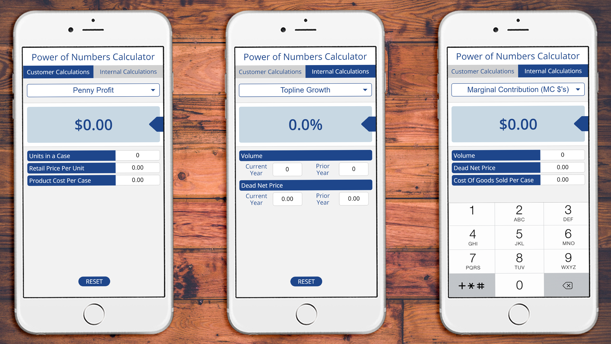
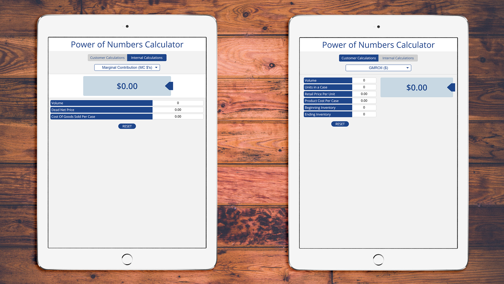

A web-based app built for mobile devices to assist an in-store sales team to drive profit.

Requirements were that it had to be easily updatable by someone with little javascript knowledge. Hince the reason I wasn't able to include es6 or any advance frameworks and libraries.

The original system was built on HTML tables and flash. I used RequireJS to split the Javascript files up so I could call only what is needed depending on the page. This also allowed me to make it modular if I needed to add in features later.

Primary use is on phones and tablets but required support down to IE11. The system uses local web storage to retain values entered into the input boxes to use on other sections and pages. Since it is primarily mobile the input boxes are set up with the "tel" input and decimal formatting is handled for the user for quicker entry. It also uses CSS Grids to easily change positions depending on the layout.

<code-links code="https://github.com/massivelines/power-of-numbers" live="https://massivelines.github.io/power-of-numbers/"></code-links>

### Tablet and Mobile

### Tel Keypad With Auto Formating Numbers

### Screen Size Based layout

