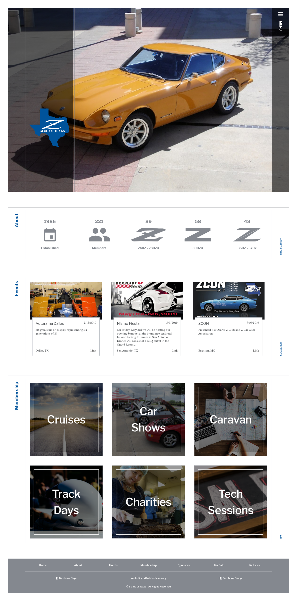

Work In Progress

A JAMstack website built for the Z Club of Texas.

A car club based in Dallas Texas needed a new website that was easy to keep updated and could be could be hosted on a shared server.

This meant that a typical CMS would not work and a Netlify CMS would cause unnecessary calls and load times. To work around a Firebase server is set up to use Google Drive as a CMS.

This ties into a Google Sheet and Google Calendar, when the files are updated it fires a function on Firebase to pull the data and update the database. This made it easy for multiple people to edit the needed files and keep the website up to date.

<code-links code="https://github.com/massivelines/zcot" live="https://zcot.netlify.com/"></code-links>

