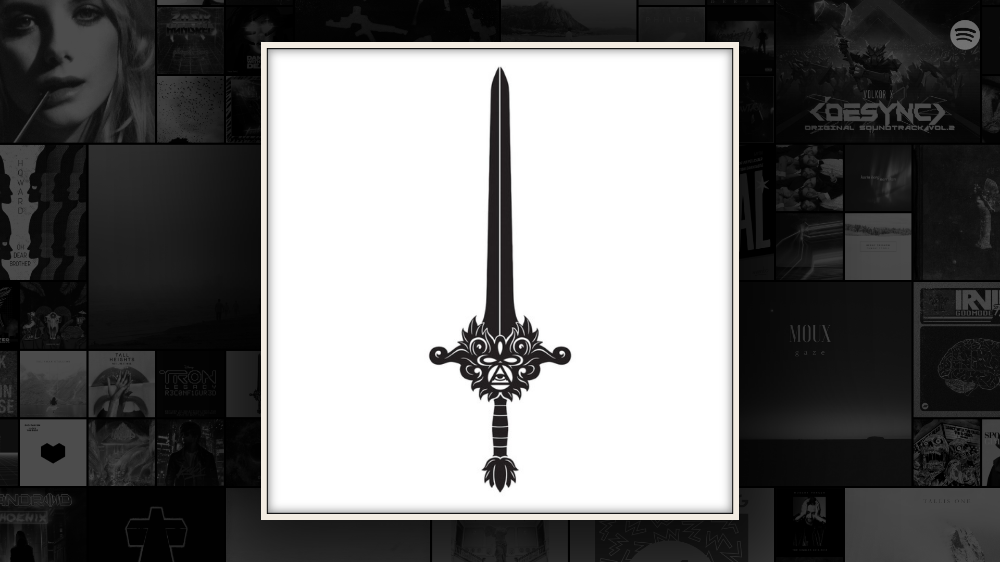
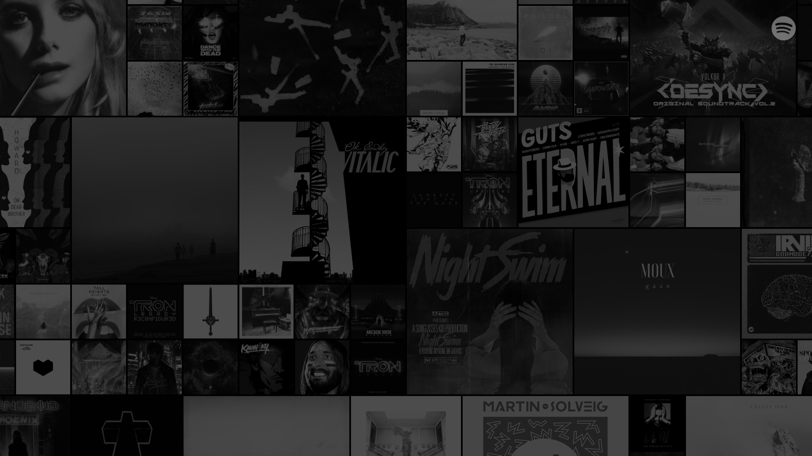

A web-based app that ties into the users currently playing Spotify album and displays the album art on any browser. It takes the users top 50 most listened to albums and the albums from the last 50 played tracks and mixes the cover art randomly together.

Using CSS3 I changed the background art to black and white, setup positioning so they clipped offscreen, added a drop shadow to the current playing art, and created a crossfade for art changes.

I built this app so I could have the Spotify album art on my tv while using other devices to play and control Spotify.

<code-links code="https://github.com/massivelines/fullscreen-album-art-for-spotify" live="https://massivelines.github.io/fullscreen-album-art-for-spotify"></code-links>

### Even work on the TV

Will work on anything that has a browser

### Fullscreen

Shows current playing album as the main focus

### Top 50

User's top 50 albums mixed with the last 50 albums listened to

