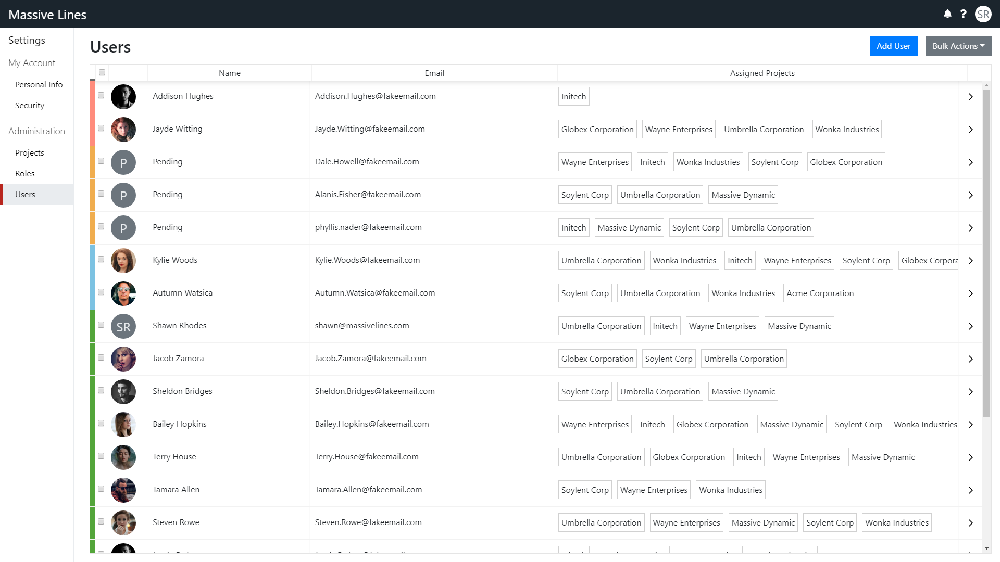
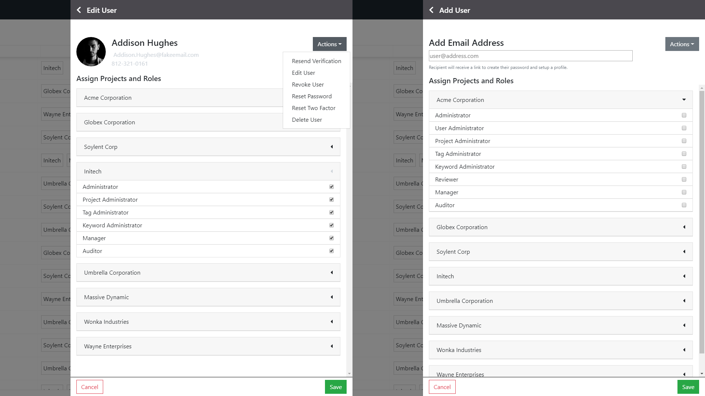
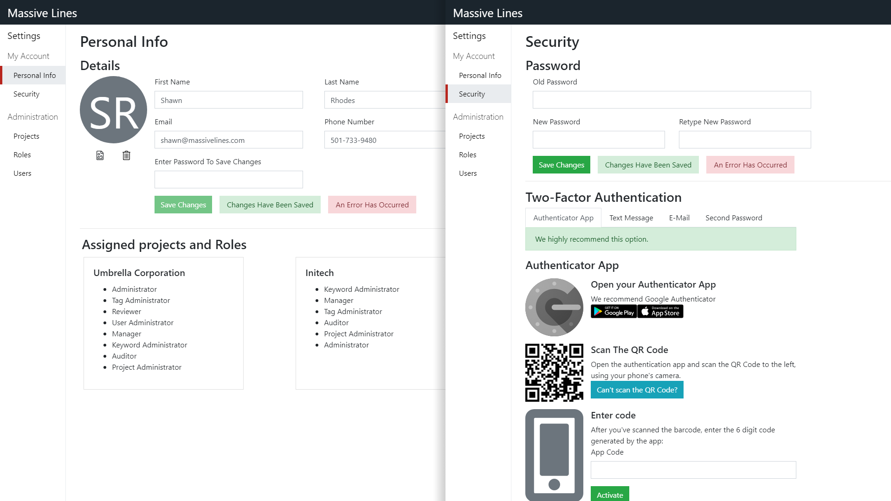

This administration system allowed users to be assigned to a project, and there access limited inside that project based on the assigned role.

Administrators could add new users, edit users, and assign them to projects and roles.

Users were also able to control what type of two-factor authorization setup they wanted to use and their own account details.

I built the GraphQL schema using mock data and graphql-tools so I could do real API calls to generate the data needed. This allowed the system to almost be a drop in after the resolvers and mutations were completed.

This was built for the Harbinger eDiscovery web app, I am allowed to use it in my portfolio, but I had to remove data and functionality due to the NDA.

<code-links code="https://github.com/massivelines/role-based-admin" live="https://massivelines.github.io/role-based-admin"></code-links>

### User Panel

### Edit and Add New Users

### Personal Settings and Security

